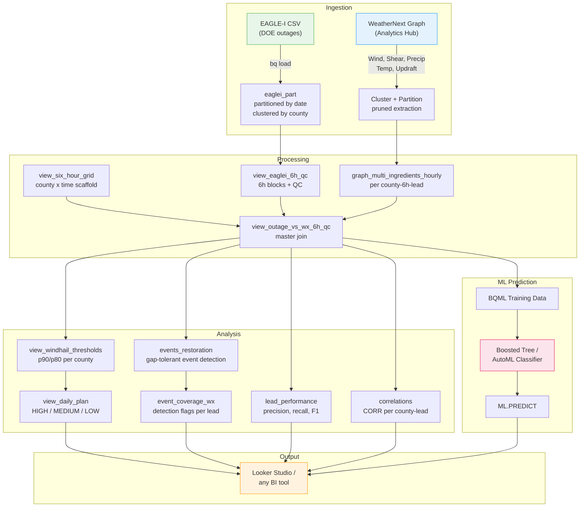

# WeatherNext Utility Forecasting

**Predict power outages 24-48 hours in advance using Google DeepMind's WeatherNext AI weather forecasts.**

This project correlates [WeatherNext](https://deepmind.google/discover/blog/graphcast-ai-model-for-faster-and-more-accurate-global-weather-forecasting/) AI weather forecasts with [EAGLE-I](https://eagle-i.doe.gov/) power outage data on Google Cloud BigQuery to help electric utilities pre-position repair crews ahead of severe weather events.

**[Full Documentation](https://biplovbhandari.github.io/weathernext-outage-forecasting/)** | [Architecture](docs/architecture.md) | [Concepts](docs/concepts.md) | [Cost Estimates](docs/cost-estimates.md)

---

## The Problem

Electric utilities mobilize repair crews *after* storms cause outages, leading to slow restoration times and high costs. Traditional weather forecasts (NWP models) are coarse and require domain expertise to interpret for grid impact.

## The Solution

WeatherNext provides high-resolution, 10-day forecasts accessible directly in BigQuery. By joining these forecasts with historical outage data, we can:

1. **Extract** multi-ingredient weather features (wind, shear, hail proxy, precipitation) at multiple lead times
2. **Detect** outage events and evaluate which forecasts detected them
3. **Score risk** per county using data-driven thresholds (p90 wind, p80 updraft)
4. **Pre-position crews** 24-48 hours before a storm hits, reducing restoration time

## Architecture




## Quick Start

### Prerequisites

- Google Cloud project with BigQuery enabled
- [WeatherNext Graph](https://console.cloud.google.com/bigquery/analytics-hub) subscription via Analytics Hub
- EAGLE-I can be downloaded from [here](https://figshare.com/s/417a4f147cf1357a5391?file=53581661).
- `gcloud` CLI installed and authenticated
- Python 3.9+ with `pip install -r python/requirements.txt`

### Steps

```bash
# 1. Clone the repo
git clone https://github.com/biplovbhandari/weathernext-outage-forecasting.git
cd weathernext-outage-forecasting

# 2. Install Python dependencies
pip install -r python/requirements.txt

# 3. Configure your environment
cp config/.env.example config/.env
# Edit config/.env with your GCP project, dataset, counties, dates, thresholds etc

# 4. Authenticate with GCP
gcloud auth application-default login

# 5. Run setup (uploads CSV to GCS, creates dataset + base tables)
python python/setup.py

# 6. IMPORTANT: Check cost before running correlation
python python/pipeline.py --phase correlation --dry-run
# Paste the step 01 SQL into BigQuery Console to verify estimated bytes

# 7. Run correlation analysis
python python/pipeline.py --phase correlation

# 8. (Optional) Run ML pipeline
python python/pipeline.py --phase ml
```

### Pipeline Phases


| Phase           | SQL Folder         | Steps | What It Does                                                                 |
| --------------- | ------------------ | ----- | ---------------------------------------------------------------------------- |
| **setup**       | `sql/setup/`       | 4     | Dataset creation, EAGLE-I load, county reference (run by `setup.py`)         |
| **correlation** | `sql/correlation/` | 10    | Weather extraction, 6h QC, events, thresholds, risk scoring, lead evaluation |
| **ml**          | `sql/ml/`          | 3     | BQML training data, regressor model training, evaluation & threshold sweep   |


### Correlation Steps Detail


| Step | File                               | Type  | Creates                          | Purpose                                                             |
| ---- | ---------------------------------- | ----- | -------------------------------- | ------------------------------------------------------------------- |
| 01   | `01_extract_multi_ingredients.sql` | TABLE | `graph_multi_ingredients_hourly` | Extract wind, shear, precip, temp from WeatherNext (expensive step) |
| 02   | `02_view_eaglei_6h_qc.sql`         | VIEW  | `view_eaglei_6h_qc`              | Aggregate EAGLE-I 15-min data into 6h blocks with QC                |
| 03   | `03_view_six_hour_grid.sql`        | VIEW  | `view_six_hour_grid`             | Generate county x 6h-timestamp scaffold for balanced joins          |
| 04   | `04_view_windhail_thresholds.sql`  | VIEW  | `view_windhail_thresholds`       | Compute p90/p80 percentile thresholds per county                    |
| 05   | `05_view_outage_vs_wx_6h_qc.sql`   | VIEW  | `view_outage_vs_wx_6h_qc`        | Master join: weather + outages + QC on 6h grid                      |
| 06   | `06_events_restoration.sql`        | TABLE | `events_restoration`             | Gap-tolerant outage event detection                                 |
| 07   | `07_event_coverage_wx.sql`         | TABLE | `event_coverage_wx`              | Per-event detection flags at each lead hour                         |
| 08   | `08_view_daily_plan.sql`           | VIEW  | `view_daily_plan`                | Daily risk tiers (HIGH/MEDIUM/LOW) with reason codes                |
| 09   | `09_lead_performance.sql`          | TABLE | `lead_performance`               | Precision, recall, F1 per lead hour                                 |
| 10   | `10_correlations.sql`              | TABLE | `correlations`                   | Pearson correlation per county per lead                             |


### ML Steps Detail


| Step | File                        | Type  | Creates                    | Purpose                                                      |
| ---- | --------------------------- | ----- | -------------------------- | ------------------------------------------------------------ |
| 01   | `01_bqml_training_data.sql` | TABLE | `bqml_training_data`       | Build features + labels from 6h master view                  |
| 02   | `02_bqml_create_model.sql`  | MODEL | `outage_predictor_regressor` | Train boosted tree regressor (predicts outage ratio 0.0–1.0) |
| 03   | `03_bqml_evaluate.sql`      | TABLE | `bqml_evaluation`, `bqml_feature_importance`, `bqml_predictions`, `bqml_threshold_sweep` | Evaluate model, feature importance, predictions, precision/recall at multiple thresholds |

> **Note:** Model training (step 02) may take several minutes. Use `--phase ml-train` to run it independently, or paste into BQ Console for progress visibility.


### CLI Options

```bash
python python/pipeline.py --phase correlation    # Correlation only
python python/pipeline.py --phase ml             # All ML steps
python python/pipeline.py --phase ml-data        # ML step 1 only: prepare training data
python python/pipeline.py --phase ml-train       # ML step 2 only: train model (may take minutes)
python python/pipeline.py --phase ml-eval        # ML step 3 only: evaluate + predictions
python python/pipeline.py --phase all            # Both (correlation + ml)
python python/pipeline.py --dry-run              # Print resolved SQL (paste into BQ Console for cost check)
python python/pipeline.py --resume               # Resume after failure (skip completed steps)
```

> **Cost warning:** Always run `--dry-run` first and verify estimated bytes in BigQuery Console before executing. Step 01 (WeatherNext extraction) is the main cost driver. See [docs/cost-estimates.md](docs/cost-estimates.md).

> **Note on `--resume`:** This is for failure recovery only. It skips steps whose target already exists. Do NOT use after changing `.env` config (counties, dates, leads), or stale data will be kept. See [docs/architecture.md](docs/architecture.md#understanding---resume).

### What the pipeline produces

- **Weather features table** -- Multi-ingredient forecasts (wind, shear, hail proxy, precip) per county per 6h block per lead
- **6h QC outage view** -- Quality-controlled outage data aligned to 6h forecast windows
- **Per-county thresholds** -- Data-driven p90/p80 percentiles (no manual tuning needed)
- **Outage events** -- Gap-tolerant event detection with start/end/peak
- **Event coverage** -- Did each forecast lead detect the event? Earliest warning lead
- **Daily risk board** -- HIGH/MEDIUM/LOW tier per county per day with reason codes
- **Lead performance** -- Precision, recall, F1 at each forecast lead time
- **Correlations** -- Pearson r between each weather feature and outage severity
- **ML predictions** -- Outage probability scored by BQML boosted tree classifier

## Key Concepts

### WeatherNext Graph

Google DeepMind's deterministic AI weather model, accessible via BigQuery Analytics Hub. Produces 10-day forecasts at 6-hourly resolution with global coverage. The table is partitioned by `init_time` and clustered by `geography`. Key fields used: 10m wind (u, v), 925 hPa wind, temperature (700/850 hPa), 6-hour precipitation, and derived features (wind shear, updraft proxy, hail flag).

### EAGLE-I

The US Department of Energy's power outage tracker. Reports county-level outage counts at 15-minute intervals. We aggregate to 6-hour blocks aligned with WeatherNext's temporal resolution and compute `outage_ratio = customers_out / total_customers`.

### 6-Hour Alignment and QC

WeatherNext forecasts at 6-hour temporal resolution. We align EAGLE-I data to matching 6-hour blocks (00-06Z, 06-12Z, etc.) and apply quality control: blocks with fewer than `MIN_SAMPLES_PER_BLOCK` readings (expect ~24 at 15-min cadence) are flagged as low-quality.

### Multi-Ingredient Features

Beyond basic 10m wind, we extract multiple weather ingredients that correlate with outage risk:

- **10m wind speed** (`ws10`): direct tree/infrastructure damage
- **925 hPa wind speed** (`ws925`): low-level jet indicator
- **0-6 km wind shear** (`shear`): severe storm potential
- **Updraft proxy** (`updraft700`): convective activity
- **Hail flag**: `t700 <= 0C AND precip >= 2mm` (freezing + moisture)

### Per-County Thresholds

Instead of fixed thresholds, we compute data-driven percentiles per county:

- **p90** for wind metrics (10m, 925 hPa, shear) -- flags the top 10% of weather
- **p80** for updraft proxy (more permissive since updraft events are rarer)

### Event Detection

Gap-tolerant outage event detection groups consecutive elevated-outage readings into discrete events, tolerating gaps of up to `EVENT_GAP_MINUTES`. Each event has start/end times, duration, and peak outage ratio. Event coverage analysis then checks whether forecasts at each lead time detected the event.

### Lead-Qualified Forecasts

We evaluate forecasts at multiple lead times (24, 30, 36, 42, 48 hours) separately. Lead performance metrics (precision, recall, F1) show how forecast skill degrades with lead time. Event coverage flags show the earliest lead that detected each event.

### ML Prediction (BQML / Vertex AI)

The **threshold-based** approach (`sql/correlation/`) uses per-county percentile thresholds for transparent, explainable risk scoring. The **ML-based** approach (`sql/ml/`) trains a classifier on weather features to predict outage probability directly. BQML boosted trees stay entirely in SQL; Vertex AI AutoML (documented in [docs/vertex-ai-guide.md](docs/vertex-ai-guide.md)) provides maximum accuracy.

## Expected Costs

> **Always verify cost with `--dry-run` before running.** Step 01 (WeatherNext extraction) is the main cost driver. Paste the resolved SQL into BigQuery Console to check estimated bytes.


| Scale                           | Estimated Cost | Notes                                                 |
| ------------------------------- | -------------- | ----------------------------------------------------- |
| 2-county demo (10 days)         | $1-5           | Depends on WeatherNext table size and cluster pruning |
| State-level (1 month)           | $5-20          | ~50 counties                                          |
| Regional (multi-state, 1 month) | $20-50         | ~200 counties                                         |
| National (all US, 1 month)      | $50-200        | ~3,200 counties                                       |


See [docs/cost-estimates.md](docs/cost-estimates.md) for detailed breakdown and optimization strategies.

## Results

The Alabama demo (May 2024) demonstrates:

- **Multi-lead correlation** between WeatherNext wind/shear forecasts and EAGLE-I outage ratios
- **Event detection** with coverage analysis across forecast lead times
- **Lead performance** showing precision/recall/F1 by forecast lead (24h vs 48h)
- **Risk scoring** with data-driven HIGH/MEDIUM/LOW tiers for crew pre-positioning

Dashboard outputs are designed for Looker Studio or any BI tool that connects to BigQuery -- see [docs/looker-studio-guide.md](docs/looker-studio-guide.md) for Looker Studio setup.

<!-- ## Contributing

Contributions welcome! See [CONTRIBUTING.md](CONTRIBUTING.md) for guidelines.

Ideas for contributions:

- WeatherNext Gen (ensemble) support for probabilistic forecasts
- Alternative visualization (Streamlit, Dash, or Superset dashboards)
- Additional outage data sources beyond EAGLE-I
- Automation with Cloud Scheduler for daily operational runs
- Regional calibration with tuned thresholds for different climate zones -->

## License

Apache 2.0 -- see [LICENSE](LICENSE).

## Acknowledgments

- [Google DeepMind](https://deepmind.google/) for WeatherNext AI weather forecasts
- [US Department of Energy](https://eagle-i.doe.gov/) for EAGLE-I outage data
- [BigQuery GIS](https://cloud.google.com/bigquery/docs/gis-intro) for spatial analysis capabilities

