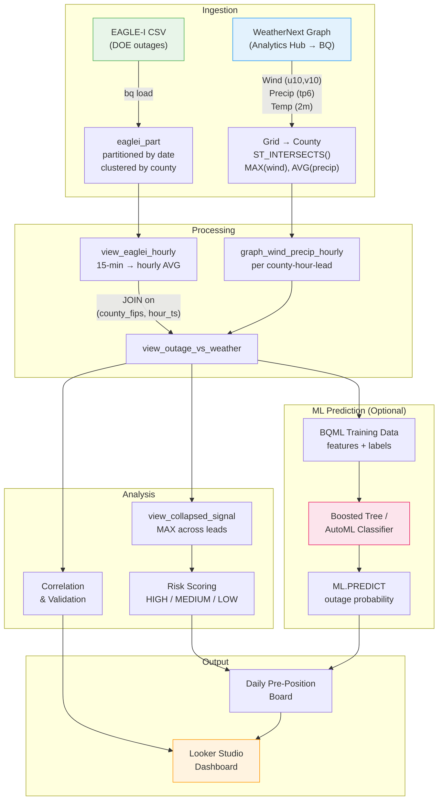

# WeatherNext Utility Forecasting

**Predict power outages 24–48 hours in advance using Google DeepMind's WeatherNext AI weather forecasts.**

This project correlates [WeatherNext](https://deepmind.google/discover/blog/graphcast-ai-model-for-faster-and-more-accurate-global-weather-forecasting/) AI weather forecasts with [EAGLE-I](https://eagle-i.doe.gov/) power outage data on Google Cloud BigQuery to help electric utilities pre-position repair crews ahead of severe weather events. EAGLE-I can be downloaded from [here](https://figshare.com/s/417a4f147cf1357a5391?file=53581661). We are using 2024 for this repo.

---

## The Problem

Electric utilities mobilize repair crews *after* storms cause outages, leading to slow restoration times and high costs. Traditional weather forecasts (NWP models) are coarse and require domain expertise to interpret for grid impact.

## The Solution

WeatherNext (Google DeepMind's AI weather model) provides high-resolution, 10-day forecasts accessible directly in BigQuery. By joining these forecasts with historical outage data, we can:

1. **Validate** that AI weather forecasts correlate with actual outage events
2. **Train ML models** (BQML or Vertex AI AutoML) to predict outage probability from forecast features
3. **Score risk** per county using model predictions or threshold-based rules
4. **Pre-position crews** 24–48 hours before a storm hits, reducing restoration time

## Architecture



## Quick Start

### Prerequisites

- Google Cloud project with BigQuery enabled
- [WeatherNext Graph](https://console.cloud.google.com/bigquery/analytics-hub) subscription via Analytics Hub
- EAGLE-I outage data CSV (download from [eagle-i.doe.gov](https://eagle-i.doe.gov/))
- `gcloud` CLI installed and authenticated
- Python 3.9+ with `pip install -r python/requirements.txt`

### Steps

```bash
# 1. Clone the repo
git clone https://github.com/YOUR_USERNAME/weathernext-utility-forecasting.git
cd weathernext-utility-forecasting

# 2. Install Python dependencies
pip install -r python/requirements.txt

# 3. Configure your environment
cp config/.env.example config/.env
# Edit config/.env with your GCP project, dataset, counties, dates

# 4. Authenticate with GCP
gcloud auth application-default login

# 5. Run setup (uploads CSV to GCS, creates dataset + base tables)
python python/setup.py

# 6. Run correlation analysis (weather extraction → risk scoring → preboard)
python python/pipeline.py --phase correlation

# 7. (Optional) Run ML pipeline (training → model → evaluation)
python python/pipeline.py --phase ml
```

### Pipeline Phases

| Phase | SQL Folder | What It Does |
|-------|-----------|--------------|
| **setup** | `sql/setup/` | Dataset creation, EAGLE-I load, county reference, hourly view (run by `setup.py`) |
| **correlation** | `sql/correlation/` | WeatherNext extraction, outage join, collapsed signal, risk scoring, crew preboard |
| **ml** | `sql/ml/` | BQML training data, model training (boosted tree), evaluation & predictions |

### CLI Options

```bash
python python/pipeline.py --phase correlation    # Correlation only
python python/pipeline.py --phase ml             # ML only
python python/pipeline.py --phase all             # Both (correlation + ml)
python python/pipeline.py --dry-run              # Print SQL without executing
python python/pipeline.py --dry-run -v           # Print full parameterized SQL
```

### What the pipeline produces

- **Weather features table** — Wind speed and precipitation from WeatherNext, 24–48h lead per county
- **Outage vs weather view** — Joined table for correlation analysis
- **Risk scoring view** — Composite risk score (HIGH/MEDIUM/LOW tiers)
- **Daily preboard** — Crew pre-positioning recommendations per county
- **ML predictions** — Outage probability scored by BQML boosted tree classifier

## Project Structure

```
weathernext-utility-forecasting/
├── README.md
├── config/
│   └── .env.example                   # Environment variable template
├── python/
│   ├── requirements.txt               # Python dependencies
│   ├── config.py                      # Configuration from .env
│   ├── setup.py                       # One-time setup (GCS upload + base tables)
│   └── pipeline.py                    # SQL pipeline orchestrator
├── sql/
│   ├── setup/                         # Base tables (run by setup.py)
│   │   ├── 01_setup_dataset.sql
│   │   ├── 02_create_eaglei_raw.sql
│   │   ├── 03_create_eaglei_partitioned.sql
│   │   ├── 04_create_counties_ref.sql
│   │   └── 05_create_view_eaglei_hourly.sql
│   ├── correlation/                   # Weather → risk analysis
│   │   ├── 01_extract_weather_features.sql
│   │   ├── 02_create_view_outage_vs_weather.sql
│   │   ├── 03_create_view_collapsed_signal.sql
│   │   ├── 04_risk_scoring.sql
│   │   └── 05_daily_preboard.sql
│   └── ml/                            # ML training + evaluation
│       ├── 01_bqml_training_data.sql
│       ├── 02_bqml_create_model.sql
│       └── 03_bqml_evaluate.sql
├── looker/
│   └── dashboard-views.sql            # Looker Studio-optimized views
└── docs/
    ├── architecture.md
    ├── concepts.md
    ├── cost-estimates.md
    ├── data-sources.md
    ├── looker-studio-guide.md
    └── vertex-ai-guide.md
```

## Key Concepts

### WeatherNext Graph

Google DeepMind's deterministic AI weather model, accessible via BigQuery Analytics Hub. Produces 10-day forecasts at 6-hourly resolution with global coverage. Key fields used: 10m wind components (u, v), 6-hour precipitation, 2m temperature.

### EAGLE-I

The US Department of Energy's power outage tracker. Reports county-level outage counts at 15-minute intervals. We compute `outage_ratio = customers_out / total_customers` as the primary metric.

### Spatial Joins

WeatherNext forecasts are on a global grid. We use `ST_INTERSECTS()` in BigQuery to match grid cells to US county polygons, then aggregate (MAX wind, MEAN precipitation) per county per hour.

### Lead-Qualified Forecasts

We keep forecasts at multiple lead times (24, 30, 36, 42, 48 hours) separately, then collapse to a "worst case" signal. If *any* lead time flags high wind, the hour is flagged. This supports operational messaging like "flagged at both 48h and 24h — high confidence."

### ML Prediction (BQML / Vertex AI)

The project supports two approaches to outage prediction. The **threshold-based** approach (`sql/correlation/`) uses manually tuned wind/precip thresholds for transparent, explainable risk scoring. The **ML-based** approach (`sql/ml/`) trains a classifier on weather features to predict outage probability directly. BQML boosted trees stay entirely in SQL; Vertex AI AutoML (documented in [docs/vertex-ai-guide.md](docs/vertex-ai-guide.md)) provides maximum accuracy. The original demo achieved precision ~0.67, recall ~0.89, F1 ~0.76 with AutoML.

## Expected Costs

| Scale | Monthly Estimate | Notes |
|-------|-----------------|-------|
| 2-county demo (10 days) | < $1 | Minimal BigQuery scans |
| State-level (1 month) | $5–20 | ~50 counties, daily runs |
| Regional (multi-state, 1 month) | $20–50 | ~200 counties |
| National (all US, 1 month) | $50–200 | ~3,200 counties |

See [docs/cost-estimates.md](docs/cost-estimates.md) for detailed breakdown.

## Results

The Alabama demo (May 2024) demonstrates:

- **Correlation** between WeatherNext wind forecasts and EAGLE-I outage ratios
- **Hit/miss analysis** showing forecast skill at wind ≥ 17 m/s threshold
- **Lead time comparison** showing correlation by forecast lead (24h vs 48h)
- **Risk scoring** with HIGH/MEDIUM/LOW tiers for crew pre-positioning

Dashboard outputs are designed for Looker Studio — see [docs/looker-studio-guide.md](docs/looker-studio-guide.md) for setup.

## Contributing

Contributions welcome! See [CONTRIBUTING.md](CONTRIBUTING.md) for guidelines.

Ideas for contributions:

- Additional weather variables (hail, icing, temperature extremes)
- WeatherNext Gen (ensemble) support for probabilistic forecasts
- Alternative visualization (Streamlit, Dash, or Superset dashboards)
- ML models for outage prediction (beyond threshold-based)
- Automation with Cloud Scheduler for daily operational runs
- Additional outage data sources beyond EAGLE-I

## License

Apache 2.0 — see [LICENSE](LICENSE).

## Acknowledgments

- [Google DeepMind](https://deepmind.google/) for WeatherNext AI weather forecasts
- [US Department of Energy](https://eagle-i.doe.gov/) for EAGLE-I outage data
- [BigQuery GIS](https://cloud.google.com/bigquery/docs/gis-intro) for spatial analysis capabilities
