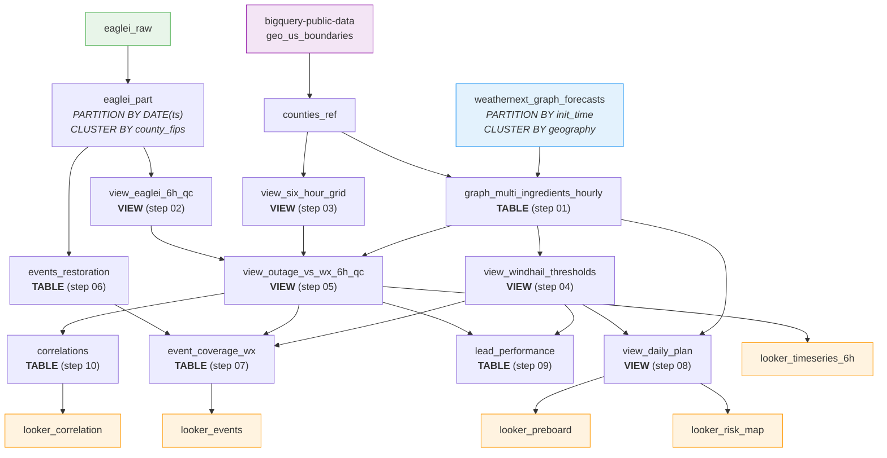

# System Architecture

## Overview

The system operates entirely within Google Cloud Platform, using BigQuery as the central data warehouse. There are no external servers, APIs, or ML training pipelines -- the entire workflow is SQL-based with Python orchestration (`pipeline.py`).

## Data Flow

### 1. Ingestion Layer

**EAGLE-I Outage Data:**
CSV files from the US DOE EAGLE-I system are uploaded to Google Cloud Storage, then loaded into BigQuery via `bq load`. The raw data has 15-minute granularity at the county level with fields: `fips_code`, `county`, `state`, `customers_out`, `run_start_time`, `total_customers`

The raw data is transformed into an optimized table (`eaglei_part`) that partitions by date and clusters by county FIPS. This is critical for query cost -- BigQuery only scans the date partitions you need.

**WeatherNext Graph Forecasts:**
WeatherNext data is accessed through BigQuery Analytics Hub. You subscribe to the WeatherNext Graph listing, which creates a linked dataset in your project. No data copying occurs -- you query the shared table directly.

The forecast table is partitioned by `init_time` and clustered by `geography`. Each row represents one grid point at one initialization time, with a repeated `forecast` field containing the full 10-day forecast (~89 variables at 6-hour intervals).

**County Reference Geometry:**
US county boundaries come from `bigquery-public-data.geo_us_boundaries`. We materialize this into a project-local `counties_ref` table joined with state names.

### 2. Processing Layer

**6-Hour Temporal Alignment (steps 02-03):**
WeatherNext forecasts at 6-hourly resolution. We aggregate EAGLE-I 15-minute data into matching 6-hour blocks (00-06Z, 06-12Z, etc.) with quality control -- blocks with fewer than `MIN_SAMPLES_PER_BLOCK` readings are flagged. A canonical 6-hour grid scaffold ensures balanced LEFT JOINs (zero-outage periods get rows too).

**Multi-Ingredient Weather Extraction (step 01):**
The most expensive step. Extracts multiple weather features from WeatherNext using cluster pruning (pre-computed AOI with `ST_INTERSECTS`) and partition pruning (explicit `init_time` timestamps). Features extracted per county per 6h block per lead:

- 10m wind speed (from u/v components)
- 925 hPa wind speed (low-level jet)
- 0-6 km wind shear (severe storm potential)
- 700 hPa updraft proxy (convective activity)
- 700/850 hPa temperature (for hail/icing flags)
- 6h precipitation

**Per-County Thresholds (step 04):**
Instead of manually tuning fixed thresholds, we compute data-driven percentiles from the weather extraction: p90 for wind metrics, p80 for updraft. These are per-county, so a windy coastal county has a higher p90 than a sheltered inland county.

**Master Join (step 05):**
The base view for all downstream analysis. LEFT JOINs weather, outages, and QC on the 6-hour grid scaffold. Includes a `hail_flag` (t700 <= 0C AND precip >= 2mm).

### 3. Analysis Layer

**Event Detection (step 06):**
Groups consecutive elevated-outage EAGLE-I readings into discrete events, tolerating gaps of up to `EVENT_GAP_MINUTES`. Output: one row per event with start/end, duration, and peak outage ratio.

**Event Coverage (step 07):**
For each outage event, checks whether weather forecasts at each lead hour (24/30/36/42/48) flagged elevated risk. Outputs detection flags per lead and the earliest lead that detected each event.

**Daily Risk Plan (step 08):**
Day-level planning output -- one row per county per day. Tiers:

- **HIGH**: wind daymax >= county p90 confirmed by multiple leads, OR hail flagged
- **MEDIUM**: wind daymax >= county p90 from a single lead
- **LOW**: neither

Includes `reason_codes` explaining why each tier was assigned and `wind_consistency` / `hail_consistency` scores showing how many leads agree.

**Lead Performance (step 09):**
Evaluates forecast skill at each lead hour. Computes precision, recall, F1, and confusion matrix counts (TP/FP/FN/TN) using the threshold-based binary classification.

**Correlations (step 10):**
Pearson correlation between each weather feature and outage severity, grouped by county and lead hour.

### 4. Output Layer

**Looker Studio Views (5 views):**

- `looker_timeseries_6h` -- Time series: outage vs weather features
- `looker_correlation` -- Heatmap: correlation by county and lead
- `looker_risk_map` -- Geo chart: risk tiers on a map
- `looker_preboard` -- Table: daily crew pre-positioning board
- `looker_events` -- Table: outage events with detection coverage

## BigQuery Table Lineage

## TABLE vs VIEW Design

The correlation pipeline uses a deliberate mix of TABLEs and VIEWs:

| Step | Object                           | Type  | Rationale                                                                          |
| ---- | -------------------------------- | ----- | ---------------------------------------------------------------------------------- |
| 01   | `graph_multi_ingredients_hourly` | TABLE | Expensive WeatherNext extraction with cluster/partition pruning. Materialize once. |
| 02   | `view_eaglei_6h_qc`              | VIEW  | Lightweight 6h aggregation of EAGLE-I. Cascades automatically.                     |
| 03   | `view_six_hour_grid`             | VIEW  | Generated scaffold (CROSS JOIN). Cascades automatically.                           |
| 04   | `view_windhail_thresholds`       | VIEW  | p90/p80 percentiles from step 01 data. Cascades when step 01 changes.              |
| 05   | `view_outage_vs_wx_6h_qc`        | VIEW  | Master join of weather + outage + QC. Cascades automatically.                      |
| 06   | `events_restoration`             | TABLE | Event detection from raw EAGLE-I data. Re-run when date range changes.             |
| 07   | `event_coverage_wx`              | TABLE | Joins events with forecasts. Re-run when events or weather data changes.           |
| 08   | `view_daily_plan`                | VIEW  | Day-level risk tiers from thresholds + weather. Cascades automatically.            |
| 09   | `lead_performance`               | TABLE | Precision/recall/F1 computation. Re-run when data changes.                         |
| 10   | `correlations`                   | TABLE | Pearson correlation computation. Re-run when data changes.                         |

**Rule of thumb:** TABLE for expensive operations and statistical computations. VIEW for lightweight joins and transformations that should stay current.

### Updating the Pipeline

When you change configuration in `config/.env`:

| Scenario                      | `.env` changes           | Re-run setup?                          | Steps to re-run             |
| ----------------------------- | ------------------------ | -------------------------------------- | --------------------------- |
| Add more counties             | `COUNTY_FIPS`            | Maybe (if EAGLE-I CSV needs expansion) | All (run without --resume)  |
| Expand date range             | `START_DATE`, `END_DATE` | Maybe (if EAGLE-I CSV needs expansion) | All (run without --resume)  |
| Change lead hours             | `LEAD_HOURS`             | No                                     | All (run without --resume)  |
| Change init hours             | `INIT_HOURS`             | No                                     | Step 01 + downstream TABLEs |
| Change event detection params | `EVENT_`*                | No                                     | Steps 06-07 + downstream    |
| Change QC threshold           | `MIN_SAMPLES_PER_BLOCK`  | No                                     | Steps 09-10 (VIEWs cascade) |
| Change outage threshold       | `OUTAGE_THRESHOLD`       | No                                     | Steps 09 + ML phase         |

**VIEWs (steps 02-05, 08) never need explicit re-running** -- they cascade automatically when upstream data changes.

### Understanding `--resume`

The `--resume` flag is for **recovering from partial failures only**. It skips any step whose target already exists in BigQuery.

| Scenario                        | Command                                           | Behavior                        |
| ------------------------------- | ------------------------------------------------- | ------------------------------- |
| First run                       | `python pipeline.py --phase correlation`          | All steps execute               |
| Step 5 failed, fix and retry    | `python pipeline.py --phase correlation --resume` | Steps 1-4 SKIP, step 5+ execute |
| Config change (counties, dates) | `python pipeline.py --phase correlation`          | All steps re-execute            |

**Do NOT use `--resume` after changing data-affecting config.** Stale tables would be kept.

## Cost Architecture

BigQuery charges per byte scanned. The largest cost driver is the WeatherNext forecast table. Cost controls:

1. **Cluster pruning** -- Pre-compute AOI geometry, then `ST_INTERSECTS(t.geography, aoi)` leverages the geography cluster index. This is the most impactful optimization.
2. **Partition pruning** -- Explicit `init_time` timestamps (generated by pipeline.py) enable BigQuery to skip irrelevant date partitions.
3. **Column pruning** -- Only SELECT the ~6 fields needed from the ~89-band forecast array.
4. **Init time filtering** -- Default to 00Z only (1 of 4 daily runs), reducing scans by ~75%.
5. **Materialization** -- Step 01 materializes extracted features. All downstream steps read the small result table, not WeatherNext.

> **Always verify cost with `--dry-run` before running.** Paste step 01's resolved SQL into BigQuery Console to check estimated bytes.

## Configuration Reference

All pipeline parameters are configured via `config/.env`. Copy `config/.env.example` to `config/.env` and edit. The pipeline orchestrator (`pipeline.py`) injects these values into SQL `DECLARE` defaults at runtime.

| Variable                   | Default            | Description                                             |
| -------------------------- | ------------------ | ------------------------------------------------------- |
| `GCP_PROJECT`              | —                  | Your GCP project ID (required)                          |
| `DATASET_NAME`             | `weathernext_demo` | BigQuery dataset name                                   |
| `WEATHERNEXT_TABLE`        | —                  | Analytics Hub WeatherNext Graph table (required)        |
| `COUNTY_FIPS`              | `01051,01101`      | Comma-separated 5-digit county FIPS codes               |
| `START_DATE`               | `2024-05-06`       | Start of analysis window                                |
| `END_DATE`                 | `2024-05-15`       | End of analysis window                                  |
| `LEAD_HOURS`               | `24,30,36,42,48`   | Forecast lead hours to extract (6h increments)          |
| `INIT_HOURS`               | `0`                | Forecast init hours UTC (0=00Z, 0,12=00Z+12Z)           |
| `SPATIAL_BUFFER_M`         | `25000`            | Buffer around county boundaries (meters)                |
| `OUTAGE_THRESHOLD`         | `0.05`             | ML training label threshold (5% = outage event)         |
| `EVENT_OUTAGE_THRESHOLD`   | `0.005`            | Min outage ratio to flag an event (0.5%)                |
| `EVENT_GAP_MINUTES`        | `60`               | Max gap between readings to merge into one event        |
| `MIN_SAMPLES_PER_BLOCK`    | `8`                | Min EAGLE-I samples per 6h block for QC                 |
| `HAIL_TEMP_THRESHOLD`      | `0.0`              | Max 700hPa temp (°C) for hail flag                      |
| `HAIL_PRECIP_THRESHOLD`    | `2.0`              | Min precip (mm) for hail flag                           |
| `WIND_CONSISTENCY_MIN`     | `2`                | Min lead-hours flagging wind for "multi-lead-confirmed" |
| `HAIL_CONSISTENCY_MIN`     | `1`                | Min lead-hours flagging hail for HIGH tier              |
| `ML_MAX_ITERATIONS`        | `50`               | Boosted tree max iterations                             |
| `ML_LEARN_RATE`            | `0.1`              | Boosted tree learning rate                              |
| `ML_MIN_TREE_CHILD_WEIGHT` | `5`                | Min samples per tree leaf                               |
| `ML_SUBSAMPLE`             | `0.8`              | Row subsampling ratio per iteration                     |
| `ML_BUDGET_HOURS`          | `1.0`              | AutoML training budget (hours)                          |

## Security Considerations

- No sensitive data is processed (EAGLE-I is public; WeatherNext is licensed but not classified)
- GCP IAM controls access to the BigQuery dataset
- The `.env` file should never be committed (it contains your GCP project ID)
- No customer PII is present in any table
